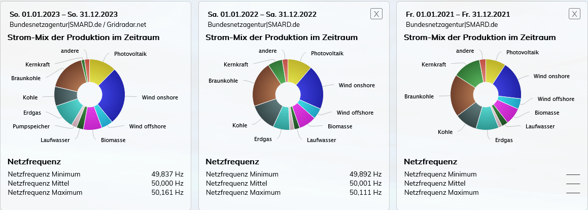

# Energie, Strom, Energiewende
In diesem Artikel geht es um Energien im allgemeinen und um das Thema Energiewende in Deutschland im speziellen. 

# Strom
## Wechselstrom
## Gleichstrom

# Stromnetz
## Netzfrequenz

# Primärenegieträger

# Sekundärenergieträger

# Kraftwerke
Laut Wikpiedia ist 'ein Kraftwerk eine technische Anlage zur Stromerzeugung und diese stellt in manchen Fällen zusätzlich thermische Energie bereit.' Weiters ist zu lesen dass 'Bei einem Kraftwerk wird mechanische Energie mittels Generatoren in elektrische Energie verwandelt, die in das Stromnetz eingespeist wird. '

Ich bin mit dieser Definition nicht ganz einverstanden, da in diesem Fall Photovoltaik kein Kraftwerk wäre. Hier gibt es keine mechanischen Teile. Wenn aber das Ziel Stromerzeugung sein soll oder jedenfalls auch, finde ich die generische Beschreibung von "Umwandlung von einer Enegieform in eine andere." eine passendere Beschreibung. Es ist trickreich, weil dann ein Motor auch ein Kraftwerk darstellen würde.

## Energiequelle
 Die Energien für die Erzeugung stammt einerseits aus 
 - kinetischer Energie
 - thermischer Energie und diese kann unterteilt werden in
    * Strahlung (Sonne)
    * Geothermie (Erdwärme)
    * Chemisch (Gas, Erdöl, Wasserstoff)
    * Kernenergie wobei man hier noch unterscheiden müsste zwischen
        + Kernspaltung
        + Kernfusion

## Zur Erzeugung von Strom
### Verfügbare Kraftwerke
- Kohlekraftwerk
- Gaskraftwerk
- Dampfkraftwerk
- Kernkraftwwerk
- Photovoltaik
- 

## Kraftwerke zur Erzeugung von Wärme
- Gas und Dampfkraftwerk
- Sonnenkollektoren
- Wärmepumpen
- Infratorheizung

## Kraftwerke zur Erzeugung von Strom und Wärme

## Einteilung der Kraftwerke nach Last

## Eigenschaften verschiedener Kraftwerksarten
Jedes Kraftwerk hat seine spezifischen Eigenschaften. Diese Eigenschaften sind vor allem hinsichtlich der Anfordeurng an das Stromnetz von Bedeutung.

Im folgenden sei eine (nicht vollständige) Liste von Eigenschaften dargestellt, die ein Kraftwerk haben soll, unabhängig davon, ob sie diese Eigenschaft besitzt.

### Hinsichtlich Technik
- Kaltstartfähigkeit 
- Vollständig steuerbar
- Hohe Verfügbarkeit
- Geringe Wartungsanfälligkeit

### Hinsichtlich Ökonomie
- Geringe Kosten beim Bau
- Geringe Kosten im Betrieb

### Hinsichtlich Ökologie
- Geringen CO2 Abdruck
-- beim Bau
-- beim Betrieb

# Energiewarten
- 

# Speicher
## Direkte Stromspeicher
- Kondensator
- Spule

### Generelle Speichereigenschaften
## Indirekte Stromspeicher
- Akku
- Pumpspeicherkraftwerke
- Druckluft
- Schwungrad
### Generelle Speichereigenschaften

# Metriken
| Angaben in Prozent am Strommix | 2021  | 2022     | 2023     |
|--------------------------------|-------|----------|----------|
| Braunkohle                     | 19.4% | 21.0%    | 17.5%    |
| Kohle                          | 10.3% | 12.8%    | 8.9%     |
| Erdgas                         | 10.4% | 7.7%     | 11.2%    |
| Kernkraft                      | 12.9% | 6.7%     | 1.5%     |
| Windkraft offshore             | 4.8%  | 5.0%     | 5.3%     |
| Windkraft onshore              | 17.7$ | 20.4%    | 26.6%    |
| PV                             | 9.2%  | 11.2%    | 11.4%    |
| Netzfrequenz Minimum           | -     | 49.892Hz | 49.837Hz |
| Netzfrequenz Mittel            | -     | 50.001Hz | 50.000Hz |
| Netzfrequenz Maximum           | -     | 50.111Hz | 50.161Hz |

Quelle: https://www.stromdaten.info/ANALYSE/periodcomparisons/index.php

# Argumente 
## von Befürwortern der Energiewende
- Wir müssen aus den fossilen Rohstoffen raus, wegen dem CO2
- Kernkraft ist zu teuer
- Negative Preise sind gut.
- Überschüsse der erneuerbaren Energien können wir in Wasserstoff speichern
- Es gibt viele Speichermöglichkeiten
- Erneuerbare Energien umfassen nicht nur PV und WKA

## von Befürwortern der Kernkraft

# Methoden  
## mancher Befürworter der Energiewende
## mancher Befürworter der Kernkraft

